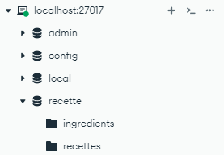

## Initialiser le projet

- MongoDB Community Server d'installé:  https://www.mongodb.com/try/download/community
- MongoDB Compass (pour avoir un GUI si besoin pour créer les tables): https://www.mongodb.com/fr-fr/products/tools/compass
- Lancer Mongo en `localhost`
- Créer la Base de données "recette"
- Créer les collections "ingredients" et "recette"
- Installer Deno: https://docs.deno.com/runtime/getting_started/installation/
- Installer Postman pour tester les routes : https://www.postman.com/downloads/
  

## Lancer le projet
Exécutez à la racine du repo: `deno --allow-net --env-file=deno.env --allow-env --allow-read --watch --allow-sys  server.ts`

Si vous ne voyez pas: `Connected to MongoDB
Server started on http://localhost:8000`
=> Vérifiez les informations dans `deno.env` nottament "MONGO_URI" et "MONGO_DB"
=> Vérifiez qu'il n'y a pas de conflit de ports.`localhost`

## Postman

Vous pouvez importer la collection `API Recettes Deno.postman_collection.json` disponible à la racine du repo.

## Feedbacks :

* Should have : Ca manque d'un dossier `src` pour ranger un peu plus.
* Nice to have : C'est bien le deno.env, pour aller encore plus loin, vous pouvez faire un deno.env.exemple et git ignore le deno.env (afin d'éviter de pusher des informations d'identification en clair).*
* C'est très bien les scripts dans la collection postman.
* 